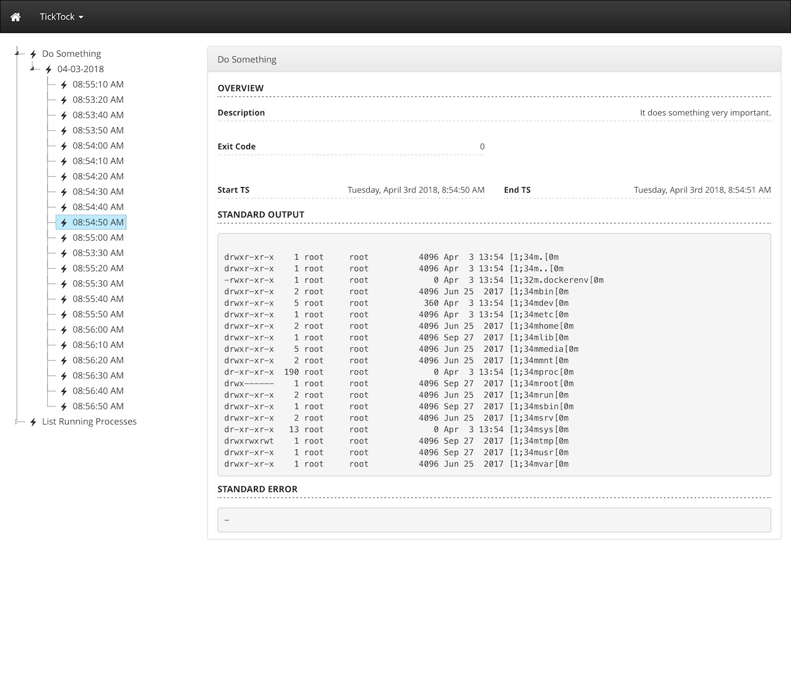

# TickTock

---

TickTock runs scheduled tasks within Docker containers. Each task can be independently configured to run within an existing container or within a container that is automatically created and subsequently removed. TickTock includes built-in support for sending task notification emails via SMTP. It can also be extended to send notifications using a custom service that you provide in the form of a [Node.js](https://nodejs.org/) script.

The interval at which a task is run is defined using natural language with the help of the [Later](https://bunkat.github.io/later/getting-started.html) module. For example, to execute a task every ten minutes you would simply set an `interval` of `every 10 minutes`. Standard [crontab](https://crontab.guru/) intervals are also supported.

TickTock provides a visual front-end (accessible via the browser) through which you can view execution results.



## Sample docker-compose.yml

A configuration file (more on that below) must be mounted into the TickTock container at `/config.yml`.

```
version: '3.4'

services:

  ticktock:
    image: tkambler/ticktock
    volumes:
      - ./example/config.yml:/config.yml
      - ./data:/var/ticktock
      - /var/run/docker.sock:/var/run/docker.sock
```

## Sample Configuration File (/config.yml)

```
# Username / password for web admin panel
admin:
  username: username
  password: password
  
# Mandatory. An array of task descriptions.
  
tasks:

  - title: Do Something
    description: It does something very important.
    interval: every 10 seconds
    # Valid values: run, exec
    # A `run` task runs within a container that is created and removed for each execution.
    type: run
    image: mhart/alpine-node:8.6.0
    command: ["ls", "-al"]
    # If overlap is enabled, tasks will continue to be executed, even if previous executions
    # have not yet completed. Default: false
    overlap: false
    # If true, automatically execute the task when TickTock is first launched. Default: false
    execute_on_start: true
    # Default: true
    enabled: false
    
  - title: List running processes
    description: It lists running processes.
    interval: every 10 seconds
    # You can also define the interval using the crontab format (see below).
    # interval: "23 16 * * *"
    # Valid values: run, exec
    # An `exec` task runs within a pre-existing container that has already been started.
    type: exec
    # The name of the container within which the task will be executed.
    container: container1
    command: ["ps", "aux"]
    overlap: false
    enabled: true
    # If specified, each time the task is run a random number between 0 and the provided value
    # will be generated. Execution of the task will then delayed by that number of seconds.
    random_delay: 20
    # If SMTP notifications have been configured, you can pass an array of recipients here.
    email:
      - foo@localhost.site
      - herp@derp.com
     # Optional. If set, notifications will be combined into a single email that is sent out
     # after x number of executions have occurred.
    batch_email_interval: 10
      
# Optional.
email:
  smtp:
    from_name: TickTock
    from_email: ticktock@localhost.site
    # Values stored under the `config` property are passed directly to NodeMailer.
    # Configuration details can be found here: http://nodemailer.com/smtp/
    config:
      host: maildev
      port: 25
      secure: false
      tls:
        secure: false
        ignoreTLS: true
        rejectUnauthorized: false
```

## Executing Tasks on Demand

Create a terminal session within the running TickTock container and run the script as shown below. You will be presented with a list of available tasks. Make a selection, and it will be immediately executed.

```
$ docker-compose exec ticktock sh
$ ./execute
````
## Generating a Task Report

Create a terminal session within the running TickTock container and run the script as shown below. You will be presented with a list of defined tasks, including the previous and next execution times for each task.

```
$ docker-compose exec ticktock sh
$ ./report
````

## Extending TickTock with Custom Notification Recipients

TickTock can be extended to send task notifications to a custom provider of your choosing. To do so, mount a Node application into the container as shown below.

```
version: '3.4'

services:

  ticktock:
    image: tkambler/ticktock
    volumes:
      - ./example/notifications:/opt/ticktock/notifications
      - ./example/config.yml:/config.yml      
      - /var/run/docker.sock:/var/run/docker.sock
```

In this example, we've mounted a `notifications` folder into the container at `/opt/ticktock/notifications`. This folder must contain a Node script named `index.js` that exports a single function, as shown below.

```
/**
 * @param task	- An object describing the task that was executed.
 * @param res 	- An object (or an array of objects, if batching was enabled) that describes the execution's result(s).
 */
module.exports = (task, res) => {
    
	// Forward to Slack, REST endpoint, IRC, etc...
    
};
```